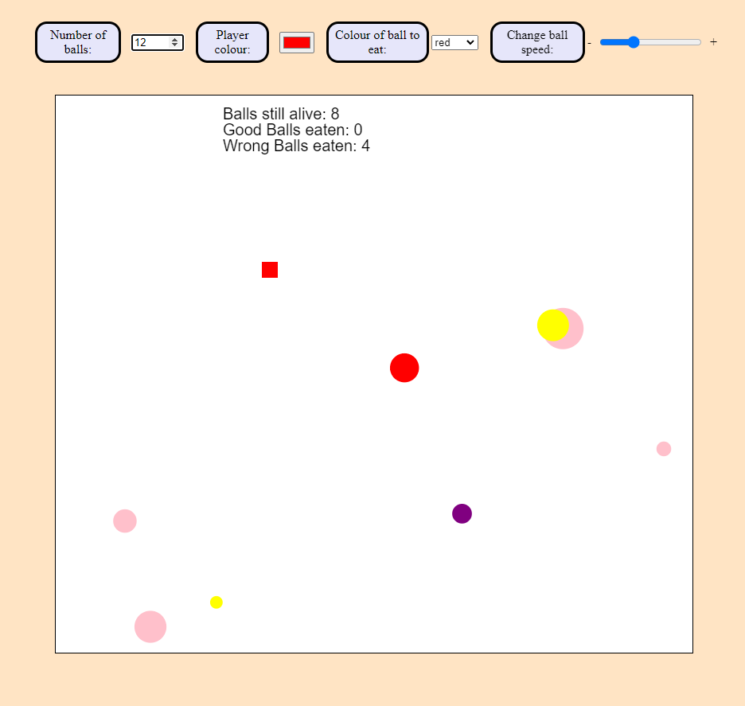

# Square Eat Game

A simple game where you must eat the balls that are of one particular colour, while avoiding the other balls.

## Contents

- [Features](#features)
- [Installation](#installation)
- [Functionality and Screenshots](#functionality-and-screenshots)
- [Credits](#credits)

## Features

- Moving a square that follows your mouse pointer, which can collide with other objects in the playing area.
- Colliding with a ball that is of the correct colour gives you a higher score, while touching any other ball colour reduces your points.
- The general speed of the balls can be changed with a slider.
- The total number of balls at the start of play can be any value between 1-30.
- The colour of the player can be changed, as well as teh colour of ball the player needs to eat.
- Background music playing during gameplay.
- Pop sound when colliding with a ball.

## Installation

- Clone the repo with `git clone https://github.com/K-Kocak/SquareEatGame.git`
- Start Live Server

## Functionality and Screenshots

*Game in progress*

Example picture of a game in progress.
- Total number of balls at the start of play is displayed at the top and can be changed with the up/down arrow on the input field. The max is 30, however a number can be inputted manually by the player to whatever value they want. (Note that with extremely high values, your browser will probably crash.)
- Player colour can be changed (the player is the square).
- The target colour the player needs to collide with (or eat) can be changed between red, green and blue.
- The speed of the balls can be increased or decreased with the slider. Faster balls naturally means more difficult to get a higher score.
- Text displaying the total number of balls still in play is displayed, as well as how many correct balls have been eaten (good balls) and incorrect balls (wrong balls).

*Winning Text*

The endstate of the game.
- Once all of the correctly coloured balls have been eaten or collided with, you win and your final score is displayed.
- Final score is calculated by doing total number of balls at the start of play minus number of bad balls eaten, so higher final score is better.
- If all balls are eaten, you will get a game over text instead (if you scored 0 essentially).

## Credits

### Tools

- JavaScript
- CSS
- HTML

[Back to Top](#contents)
